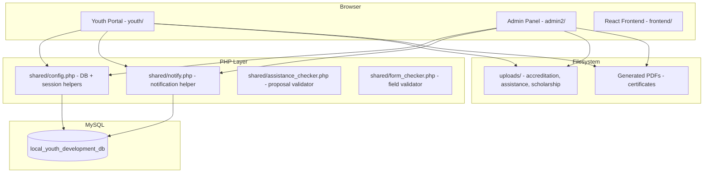

# Design Document: LYDO System

## Overview

The LYDO System is a PHP/MySQL web application running on XAMPP that digitizes four official services of the Local Youth Development Office – Sta. Cruz, Laguna. It consists of two PHP applications sharing a single MySQL database:

- **Youth Portal** (`youth/`) — accessed by registered youth users (ages 15–30) to apply for services, track application status, and receive notifications.
- **Admin Panel** (`admin2/`) — accessed by LYDO staff to review, process, and manage all applications.

A React + Vite frontend (`frontend/src/`) exists for the public-facing landing page and registration flow. The core service logic lives entirely in the PHP layer.

The system is **partially built**. The primary gaps are:

1. PDF certificate generation for accreditation and volunteer service
2. Activity logging for admin actions
3. Volunteer certificate download in the Youth Portal
4. Scholarship application notifications
5. File validation enforcement (size and type) on the server side
6. Admin activity log writes on approve/reject/status-update actions
7. The `notifications` table schema references `admin_id` in the assistance page but the table only has `user_id` — this needs to be reconciled

---

## Architecture



**Key design decisions:**

- **No REST API between PHP and React** — the React frontend handles only the public landing page and registration modal. All service logic is server-rendered PHP.
- **Session-based auth** — both portals use PHP sessions. Admin sessions additionally use a token in `admin_sessions`.
- **Shared config** — `shared/config.php` provides the `db()` PDO factory and session helpers used by both portals.
- **PDF generation** — TCPDF or FPDF (already available via Composer or manual include) will be used for certificate generation. No external service is required.

---

## Components and Interfaces

### 1. Authentication

| Component | File | Responsibility |
|---|---|---|
| Youth Login | `login.php` | Validates credentials, starts `$_SESSION['user_id']` |
| Youth Register | `register.php` | Creates `youth_users` record |
| Admin Login | `admin2/index.php` | Validates credentials, starts `$_SESSION['admin_id']` |
| Session Guard | `shared/config.php` → `requireLogin()` | Redirects unauthenticated requests |

### 2. Accreditation Service

| Component | File | Responsibility |
|---|---|---|
| Youth Application Form | `youth/accreditation.php` | Multi-doc upload form, temp file session, submission |
| Admin Review | `admin2/accreditation.php` | List, filter, single-app view, doc verify, approve/reject |
| Certificate Generator | `youth/certificate.php` | Renders PDF for approved accreditation apps |
| Workflow Engine | Inline SQL in admin page | Advances `accreditation_workflow` steps |

### 3. Assistance Service

| Component | File | Responsibility |
|---|---|---|
| Youth Request Form | `youth/assistance.php` | Multi-step form with proposal quality checker |
| Admin Review | `admin2/assistance.php` | List, filter, status update, comments, timeline |
| Proposal Checker | `shared/assistance_checker.php` | Scores proposal completeness |
| Notification Helper | `shared/notify.php` | Inserts rows into `notifications` |

### 4. Volunteer Service

| Component | File | Responsibility |
|---|---|---|
| Youth Program Browser | `youth/volunteer.php` | Browse programs, register, view attendance, leaderboard |
| Admin Management | `admin2/volunteer_admin.php` | Programs CRUD, registration updates, attendance, certificates |
| Certificate Generator | `youth/certificate.php` | Renders PDF for issued volunteer certificates |

### 5. Scholarship Service

| Component | File | Responsibility |
|---|---|---|
| Youth Application | `youth/scholarship.php` | Browse batches, apply, view status and documents |
| Admin Management | `admin2/scholarship_admin.php` | Batches CRUD, application review, doc verify, scoring |
| Export | `admin2/scholarship_export.php` | CSV/Excel export of applications |

### 6. Shared Utilities

| Component | File | Responsibility |
|---|---|---|
| DB + Session | `shared/config.php` | PDO factory, `flash()`, `requireLogin()` |
| Notifications | `shared/notify.php` | `notifyUser(PDO, userId, type, message)` |
| Form Checker | `shared/form_checker.php` | Server-side field validation helper |
| File Validator | Inline in each form handler | Extension + size checks before `move_uploaded_file` |

---

## Data Models

The database schema is defined in `database/local_youth_development_db.sql`. Below are the key tables and their roles in each service.

### Core User Tables

```
youth_users          — registered youth applicants
admin_users          — LYDO staff accounts
admin_sessions       — admin session tokens
admin_activity_log   — audit trail for admin actions
notifications        — in-system messages for youth users
```

### Accreditation Tables

```
accreditation_applications
  id, submitted_by (FK youth_users), organization_name, category, barangay,
  contact_person, contact_email, contact_phone, status, certificate_no,
  valid_until, rejection_reason, reviewed_by, reviewed_at, created_at

accreditation_documents
  id, application_id (FK), doc_type, original_name, file_path, file_size,
  status (pending|verified|rejected), reviewed_by, reviewed_at

accreditation_workflow
  id, application_id (FK), step, status (pending|completed), done_at
```

Note: `accreditation_documents` uses `file_path` in the schema but the PHP code inserts into a `filename` column. The schema needs a `filename` column added (or `file_path` renamed) for consistency.

### Assistance Tables

```
assistance_requests
  id, submitted_by (FK), organization_id (FK organizations), title,
  activity_type, description, objectives, expected_outcome, participants,
  target_date, target_venue, budget_requested, scheduled_date,
  decline_reason, status, created_at, updated_at

assistance_documents
  id, request_id (FK), doc_type, filename, original_name, file_size

assistance_timeline
  id, request_id (FK), status, note, done_by (FK admin_users), created_at

assistance_comments
  id, request_id (FK), author_id, author_type (admin|youth), comment, created_at
```

Note: The `assistance_requests` table in the SQL dump is a simplified version. The PHP code references columns (`title`, `activity_type`, `objectives`, `expected_outcome`, `participants`, `target_date`, `target_venue`, `budget_requested`, `scheduled_date`, `decline_reason`, `organization_id`, `representative_name`, `contact_number`, `contact_email`) that must be present. A migration is needed to add these columns.

### Volunteer Tables

```
volunteer_programs
  id, name, type (youth_volunteer|linggo_kabataan|junior_officials),
  description, min_age, max_age, slots, start_date, end_date,
  location, is_active, created_by (FK admin_users), created_at

volunteer_registrations
  id, user_id (FK), program_id (FK), full_name, age, birthdate, gender,
  address, contact_number, email, school_org, emergency_name,
  emergency_number, status (pending|approved|rejected|completed),
  orientation_date, notes, total_hours, certificate_issued, created_at

volunteer_attendance
  id, registration_id (FK), event_name, event_date, hours, status
  (present|absent|excused), recorded_by (FK admin_users), created_at
```

### Scholarship Tables

```
scholarship_batches
  id, name, school_year, semester, slots, gwa_required, income_limit,
  app_start, app_end, exam_date, exam_time, exam_venue, description,
  status (open|closed|evaluation|completed), created_by, created_at

scholarship_applications
  id, batch_id (FK), user_id (FK), full_name, birthdate, age, gender,
  address, contact_number, email, school_name, course, year_level,
  gwa, household_income, parent_name, parent_occupation, siblings,
  exam_score, qualification_score, exam_scheduled, rejection_reason,
  status, reviewed_by, reviewed_at, created_at

scholarship_documents
  id, application_id (FK), doc_type, filename, original_name, file_size,
  status (pending|verified|rejected), reviewed_by, reviewed_at
```

### Schema Gaps to Address

The following columns/tables are referenced in PHP code but missing from the SQL dump and must be added via migration:

| Table | Missing Column(s) |
|---|---|
| `accreditation_documents` | `filename` (code uses this; schema has `file_path`) |
| `assistance_requests` | `title`, `activity_type`, `objectives`, `expected_outcome`, `participants`, `target_date`, `target_venue`, `budget_requested`, `scheduled_date`, `decline_reason`, `organization_id`, `representative_name`, `contact_number`, `contact_email` |
| `notifications` | `link` column (referenced in assistance admin notify call) |
| `volunteer_programs` | Full table (not in SQL dump) |
| `volunteer_registrations` | Full table (not in SQL dump) |
| `volunteer_attendance` | Full table (not in SQL dump) |
| `scholarship_batches` | Full table (not in SQL dump) |
| `scholarship_applications` | Full table (not in SQL dump) |
| `scholarship_documents` | Full table (not in SQL dump) |

---

## Correctness Properties

*A property is a characteristic or behavior that should hold true across all valid executions of a system — essentially, a formal statement about what the system should do. Properties serve as the bridge between human-readable specifications and machine-verifiable correctness guarantees.*

### Property 1: Accreditation duplicate prevention

*For any* youth user with an active (non-rejected) accreditation application, submitting a new application should leave the total count of active applications for that user unchanged.

**Validates: Requirements 2.2**

---

### Property 2: Workflow step completeness on approval

*For any* accreditation application that is approved, all workflow steps in `accreditation_workflow` for that application should have status `completed`.

**Validates: Requirements 2.7**

---

### Property 3: Certificate number uniqueness

*For any* two distinct approved accreditation applications, their `certificate_no` values should be different.

**Validates: Requirements 2.7**

---

### Property 4: Document count invariant after submission

*For any* accreditation application submission with N valid uploaded files, the count of rows in `accreditation_documents` for that application should equal N after submission.

**Validates: Requirements 2.1, 2.3**

---

### Property 5: File type rejection

*For any* file upload where the file extension is not in {pdf, doc, docx, jpg, jpeg, png}, the System should reject the upload and the file should not appear in the uploads directory.

**Validates: Requirements 2.4, 5.6, 8.3**

---

### Property 6: File size rejection

*For any* file upload where the file size exceeds 10 MB, the System should reject the upload and the file should not appear in the uploads directory.

**Validates: Requirements 2.4, 5.6, 8.4**

---

### Property 7: Volunteer duplicate registration prevention

*For any* youth user and volunteer program, attempting to register twice should leave the count of registrations for that user-program pair at 1.

**Validates: Requirements 4.4**

---

### Property 8: Volunteer slot enforcement

*For any* volunteer program where the count of registrations equals `slots`, a new registration attempt should be rejected and the registration count should remain unchanged.

**Validates: Requirements 4.5**

---

### Property 9: Attendance hours accumulation

*For any* volunteer registration, the `total_hours` value should equal the sum of `hours` across all `volunteer_attendance` records for that registration.

**Validates: Requirements 4.7**

---

### Property 10: Scholarship duplicate application prevention

*For any* youth user and scholarship batch, attempting to apply twice should leave the count of applications for that user-batch pair at 1.

**Validates: Requirements 5.4**

---

### Property 11: Notification delivery on status change

*For any* application (accreditation, assistance, or scholarship) whose status is updated, a new row should exist in `notifications` for the submitting user with `is_read = 0` after the update.

**Validates: Requirements 2.11, 2.12, 3.11, 5.15**

---

### Property 12: Notification read-state transition

*For any* youth user with unread notifications, after the user views the notifications page, all previously unread notifications for that user should have `is_read = 1`.

**Validates: Requirements 7.2**

---

### Property 13: Unique filename generation

*For any* two file uploads processed by the System, the generated filenames stored in the database should be distinct (no collisions).

**Validates: Requirements 8.2**

---

### Property 14: Certificate access authorization

*For any* certificate request where the requesting user's ID does not match the `submitted_by` / `user_id` of the record, the System should return an authorization error and not serve the certificate.

**Validates: Requirements 9.3, 9.4**

---

## Error Handling

### Authentication Errors
- Unauthenticated requests to any protected page redirect to the appropriate login page.
- Failed login attempts display a generic "Invalid credentials" message (no field-level disclosure).
- Session expiry redirects to login with a flash message.

### Form Validation Errors
- Missing required fields: display inline error listing the missing fields; preserve all other form data.
- Invalid file type or size: display a specific error per file; retain other uploaded files in the temp session.
- Duplicate application/registration: display an informative message explaining the existing record.

### Database Errors
- PDO exceptions are caught at the top level; a generic error page is shown to users.
- Errors are logged to the PHP error log (not exposed to the browser).

### File System Errors
- If `move_uploaded_file` fails, the submission is rolled back (application record deleted if already inserted) and an error is shown.
- Upload directories are created with `mkdir(..., 0755, true)` if they do not exist.

---

## Testing Strategy

### Unit Tests

Unit tests verify specific examples, edge cases, and error conditions. They should cover:

- File validator: allowed extensions, rejected extensions, size boundary (exactly 10 MB, 10 MB + 1 byte)
- Certificate number format: `LYDO-{YEAR}-{XXXX}` pattern validation
- Age eligibility check: boundary values (min_age - 1, min_age, max_age, max_age + 1)
- Notification insertion: correct `user_id`, `type`, `is_read = 0`
- Workflow step initialization: exactly 6 steps created on accreditation submission

### Property-Based Tests

Property-based tests validate universal properties across many generated inputs. Each property test should run a minimum of 100 iterations.

The recommended library for PHP property-based testing is **Eris** (`giorgiosironi/eris`) or a simple custom generator loop. For JavaScript/React components, use **fast-check**.

Each property test must be tagged with a comment referencing the design property:
```
// Feature: lydo-system, Property N: <property_text>
```

**Property tests to implement:**

| Property | Test Description |
|---|---|
| Property 1 | Generate random user IDs with existing active applications; assert submit returns duplicate error |
| Property 2 | Approve random applications; assert all workflow steps are `completed` |
| Property 3 | Approve multiple applications; assert all `certificate_no` values are unique |
| Property 4 | Submit applications with N random valid files; assert doc count = N |
| Property 5 | Generate random invalid extensions; assert all are rejected |
| Property 6 | Generate random file sizes > 10 MB; assert all are rejected |
| Property 7 | Register same user-program pair twice; assert count stays at 1 |
| Property 8 | Fill program to capacity; assert next registration is rejected |
| Property 9 | Record random attendance entries; assert total_hours = sum of hours |
| Property 10 | Apply same user-batch pair twice; assert count stays at 1 |
| Property 11 | Update application status; assert notification row exists with is_read = 0 |
| Property 12 | Create unread notifications; load notifications page; assert all is_read = 1 |
| Property 13 | Upload multiple files; assert all generated filenames are distinct |
| Property 14 | Request certificate with wrong user ID; assert authorization error |

### Integration Tests

- Full accreditation submission flow: register user → submit application with 5 docs → admin approves → certificate available
- Full scholarship flow: create batch → youth applies → admin sets for_exam → records score → approves → beneficiary appears
- Volunteer flow: create program → youth registers → admin approves → admin records attendance → issues certificate → youth downloads
